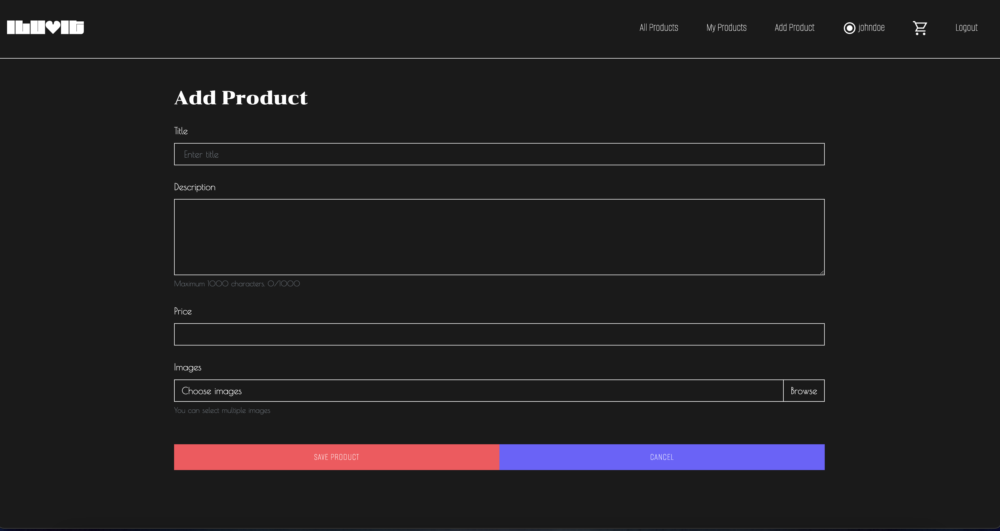

# ILUVIT

[ILUVIT](https://iluvit-app.vercel.app/) is an ecommerce app or site for selling second-hand design items.

## Description

ILUVIT. Buy. Sell. Appreciate. A clean space for second-hand design. List items, browse others, leave comments, and manage your account — simply.

The site is monitored and curated, so that the quality of the items meets the users' expectations. Although, we doubt that anyone would be so indifferent, that she would sabotage the store by trying to sell felt Christmas gnomes or something similar?

## UI

A walkthrough of the app is available [here](https://youtu.be/kp4rbC9mkaQ).

## License

MIT License
